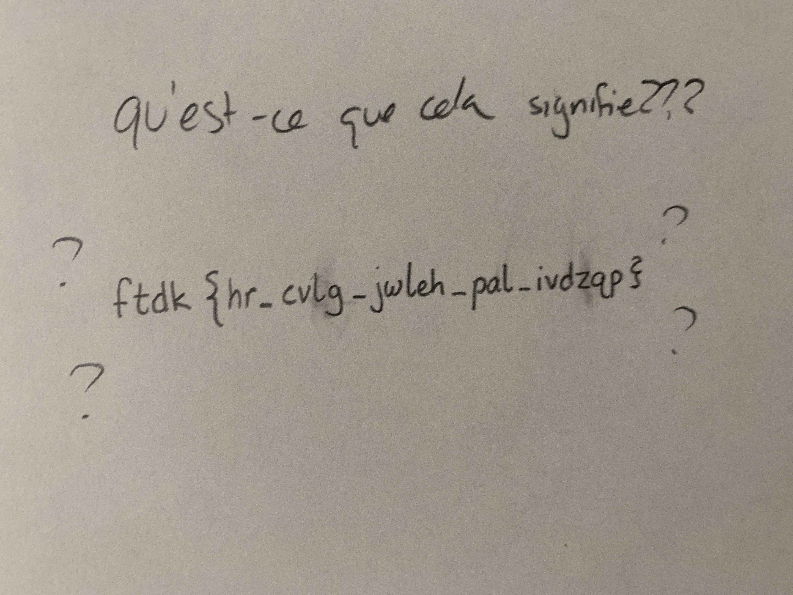

# frenchman
Type: **Cryptography**

Hey, so uhhh... this French dude came into the building and was screaming something?

I think they said:
> **aidezmoi**! Ils m'ont laissé dans un lycée américain!

I'm not sure; I don't speak French.

Anyway, they seemed stressed about this sheet of paper. Any idea?

*The answer is of the format `flag{answer}`.*

Hint 1

I think the dude was mentioning something about "le chiffrage indéchiffrable"? Something about a V guy??

Answer

<code>flag{if_only_gsmst_had_french}</code>

